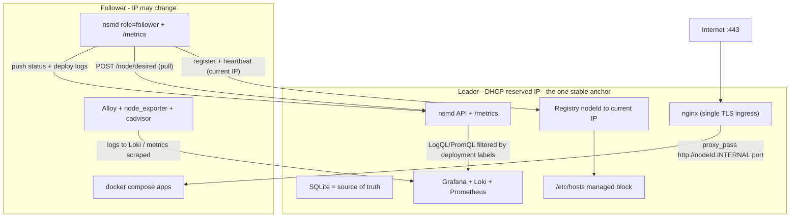
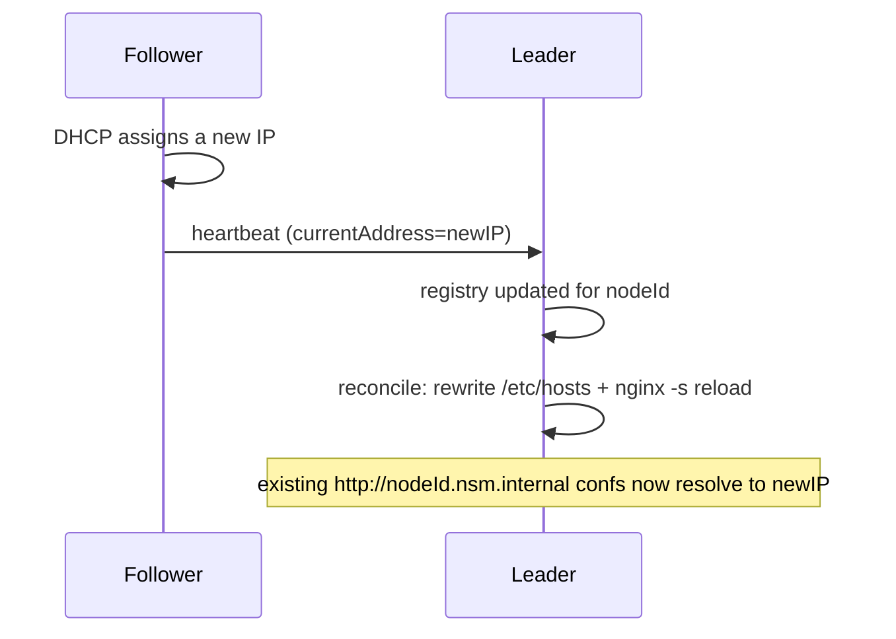

# NSM — Node Server Manager

NSM is a self-managing deployment system. You run a **single identical daemon (`nsmd`) on every machine** in a small fleet. Exactly one machine is statically declared the **leader**; its SQLite database is the single source of truth. The leader clones your app repos, injects secrets, runs them with `docker compose`, renders nginx, and issues TLS certs. Followers pull their assigned work from the leader and report status back.

Two design goals shape everything:

- **IP-less identity.** Nodes identify each other by a stable `nodeId`, never by IP. The leader keeps a `nodeId -> current IP` registry that every node updates via heartbeat, so a node's LAN IP can change (DHCP) without breaking routing.
- **Full observability.** A self-hosted Grafana + Loki + Prometheus stack collects logs and metrics from every node, tagged per deployment, so logs/stats for one deployment are directly queryable through the NSM API.

---

## Table of contents

- [Architecture](#architecture)
- [Coordination model (leader + registry)](#coordination-model-leader--registry)
- [IP-less routing](#ip-less-routing)
- [Ingress and TLS](#ingress-and-tls)
- [Observability](#observability)
- [Management UI](#management-ui)
- [How a deployment flows](#how-a-deployment-flows)
- [Failure handling](#failure-handling)
- [Repository layout](#repository-layout)
- [Configuration reference](#configuration-reference)
- [Setting up a network](#setting-up-a-network)
- [HTTP API surface](#http-api-surface)
- [Development and testing](#development-and-testing)

---

## Architecture



Every node runs the same `nsmd` process (on the host, via systemd, so it can drive `docker`/`nginx`/`certbot` directly). The only difference between nodes is `NSM_ROLE`.

All backend paths below are under `backend/`.

| Component | Path | Responsibility |
| --- | --- | --- |
| Cluster facade | `backend/src/cluster/node.ts` | `isLeader()`/`leaderAddress()` from config; `propose()` applies ops directly on the leader. |
| Registry | `backend/src/cluster/registry.ts` | Leader-hosted `nodeId -> current IP` map; register/heartbeat/deregister. |
| State machine | `backend/src/cluster/stateMachine.ts` | Applies each `Op` to the leader's SQLite source of truth. |
| Reconciler | `backend/src/reconcile/reconciler.ts` | Followers pull desired state; every node converges its host; leader renders ingress. |
| Internal DNS | `backend/src/reconcile/internalDns.ts` | Leader writes `/etc/hosts` mapping `<nodeId>.<domain>` to current IPs. |
| Certs | `backend/src/reconcile/certs.ts` | Leader-only certbot; certs live only on the leader (single ingress). |
| Observability | `backend/src/reconcile/observabilityStack.ts`, `promTargets.ts`, `backend/src/controllers/observabilityController.ts` | Bring up the stack, generate Prometheus targets, proxy per-deployment queries. |

---

## Coordination model (leader + registry)

- **One leader, declared in config.** Exactly one node sets `NSM_ROLE=leader`; all others are `follower`. There is no election and no automatic failover.
- **The leader's SQLite DB is the sole source of truth.** All writes are `Op`s applied directly on the leader (`cluster.propose(op)` -> `applyOp(op)`). Followers do not hold authoritative state.
- **Writes forward to the leader.** Any node accepts private API calls; write handlers call `requireLeader`, which proxies to the leader (`forwardToLeader`) using the stable `LEADER_ADDRESS`.
- **Followers pull, then push.** Each reconcile tick, a follower `POST /node/desired` to get its assigned `DesiredDeployment`s plus the registry snapshot, mirrors them into its local DB, and converges. It pushes status + deploy logs back to the leader.
- **The one stable anchor** is `LEADER_ADDRESS` — give the leader machine a DHCP reservation/static IP. Every other address is dynamic and resolved through the registry.

If the leader is down: running apps keep serving, but no new deploys/writes happen, and followers skip reconciliation (they never tear down running apps on a failed pull) until the leader returns.

---

## IP-less routing

Today a node's IP is never baked into a config. Instead:

1. Each node detects its current primary IP (`getPrimaryIp()`), registers it with the leader on boot, and re-asserts it on every heartbeat. An IP change for a stable `nodeId` propagates into the registry within one interval.
2. Rendered nginx configs target the assigned node's **stable internal hostname**: `proxy_pass http://<nodeId>.<INTERNAL_DOMAIN>:<port>` (e.g. `http://node-2.nsm.internal:34011`).
3. The leader maintains a managed block in `/etc/hosts` mapping every `<nodeId>.<INTERNAL_DOMAIN>` to its current IP (`refreshInternalHosts()`), and reloads nginx only when the mapping changes.

Because confs are IP-free, an IP change never re-renders a conf — it only refreshes the hosts mapping and reloads nginx.



---

## Ingress and TLS

- The **leader is the single public 443 entrypoint**. Point your router's 443 forward and your app DNS at the leader (DHCP-reserved). The leader terminates TLS and reverse-proxies to backend nodes by internal hostname.
- Only the leader renders nginx (`renderAllNginx`, guarded by `isLeader()`); followers just run app containers.
- Certs are **leader-local**: `leaderEnsureCerts()` runs certbot (DNS-01 when `CERTBOT_DNS_ARGS` is set, else `--nginx`) and keeps material in `LETSENCRYPT_LIVE_DIR`. No cross-node cert replication.
- The leader also **fronts its own dashboard over TLS**. When `NSM_PUBLIC_URL` (or `FRONTEND_URL`) is an `https://` FQDN, the reconciler obtains a cert for that host and renders a vhost (`dashboardIngress.ts`) that proxies `:443` → the local daemon, so `https://<dashboard-domain>/` just works. Requires the domain's DNS `A` record to point at the leader and ports 80/443 reachable. If the public URL is plain HTTP, an IP, or `localhost`, no dashboard cert/vhost is created and you use `http://<leader-ip>:1025`.

---

## Cloudflare DNS and domains

An optional, cluster-wide Cloudflare integration lets NSM manage DNS records and (optionally) buy and manage domains, all from the leader. It is enabled by setting `CLOUDFLARE_API_TOKEN` (and `CLOUDFLARE_ACCOUNT_ID` for domain purchasing); when unset, the feature is inert.

- **Cloudflare is authoritative.** The leader keeps a local cache (`DnsZoneModel` / `DnsRecordModel`, like the cert cache) refreshed every 5 minutes by `cloudflareSync.ts`. External changes in Cloudflare (a domain canceled, paused, or edited) cascade into NSM on the next sync; NSM writes to Cloudflare **only** on explicit in-NSM edits (record CRUD, an approved purchase, a delete) and dynamic-IP repushes.
- **DNS records are managed at the domain level** by NSM admins, from the domain detail modal on the `/domains` page — not per project. Project config only *references* an allocated domain through the config picker.
- **Domain allocations.** Each domain can be allocated to zero or more teams; only allocated domains appear in a team's project config picker. A team cannot be de-allocated while one of its projects still references the domain (the API returns the blocking projects).
- **Purchasing is super-admin-only.** Anyone with `CREATE_PROJECT` on a team can search Cloudflare and submit a purchase *request*, which notifies the super admin (web push). The super admin approves (which re-checks the price, registers the domain — spending money — adopts the zone, and allocates it to the requester's team) or denies (which notifies the requester). The super admin can also buy directly. Registrations are non-refundable.
- **Deleting a domain is super-admin-only** and requires typing the domain name to confirm. It removes the zone from Cloudflare and **best-effort disables registrar auto-renew** to stop billing. The Registrar API (beta) may not support toggling auto-renew; if the call fails, NSM logs a warning and you must disable auto-renew in the Cloudflare dashboard to actually stop billing.
- **Dynamic public IP.** For home networks without a static IP, mark an `A`/`AAAA` record "dynamic". NSM tags it via the Cloudflare record `comment` (so the flag lives in Cloudflare and survives re-sync), polls the public IP every `PUBLIC_IP_POLL_MINUTES` (default 10) via ipify (Cloudflare `cdn-cgi/trace` fallback), and PATCHes every dynamic record when the WAN IP changes.
- **Billing estimate.** The domains page shows per-currency monthly/yearly renewal estimates from known renewal prices. Domains added outside NSM may not report a price (Cloudflare does not return pricing for owned domains), so those rows show `—`.

**Proxy vs Let's Encrypt (important interaction):** enabling Cloudflare's proxy (orange cloud) on a project's domain breaks certbot's HTTP-01 `--nginx` challenge, because Cloudflare intercepts `:80`. If you proxy a domain NSM issues certs for, switch cert issuance to **DNS-01** by setting `CERTBOT_DNS_ARGS` (e.g. the Cloudflare plugin), or leave the record grey-clouded (DNS-only) for issuance. NSM does not auto-toggle the cloud color.

---

## Observability

A self-hosted stack (leader) plus per-node agents give logs + metrics filterable per deployment.

- **Leader stack** (`deploy/observability/docker-compose.yml`): Grafana, Loki, Prometheus. Brought up at boot by `ensureObservabilityStack()`.
- **Per-node agents** (`deploy/agent/docker-compose.yml`, on every node): Grafana Alloy (logs), node_exporter (host metrics), cadvisor (container metrics).
- **Deployment labels.** App containers are labeled with `dev.mosaiq.nsm.projectId`, `.projectInstanceId`, `.serviceInstanceId`, `.serviceName`, `.managed`. Alloy relabels these into Loki labels; cadvisor exposes them for Prometheus (`metric_relabel_configs` promote them to `projectInstanceId`, etc.).
- **nsmd logs.** `nsmd` logs structured JSON (pino); journald captures it; Alloy ships it to Loki labeled `source="nsmd"`, so control-plane and app logs are queryable together. Every log line carries an `area` field (e.g. `http`, `reconcile`, `deploy`, `cluster`, `certs`) plus an `action` field, so you can filter to a subsystem or event in Loki with `source="nsmd" | json | area="reconcile"`. There is no verbosity knob: nsmd always emits every action - API requests, cluster writes, deploys, reconcile state changes, plus the 5s reconcile / 15s gossip ticks, per-line deploy output, and readiness/port probes. Secrets, tokens, cluster secret, private keys, and dotenv contents are redacted from logs.
- **IP-less scraping.** `promTargets.ts` regenerates Prometheus file-SD targets from the registry using internal hostnames.
- **Query API.** The leader exposes `GET /observability/logs` and `GET /observability/metrics`, which proxy LogQL/PromQL filtered by `serviceInstanceId | projectInstanceId | projectId`, so the NSM UI can show logs/stats for one deployment. Every node also exposes `GET /metrics` (deploy/reconcile counters and durations).

---

## Management UI

NSM ships its own management UI in `frontend/` — a Vite + React + Mantine single-page app that replaces the old external `server-manager` frontend. There is no separate service to run: the leader daemon serves the built UI **same-origin** with the API.

- **Same-origin serving.** `initApp()` mounts `express.static(NSM_WWW_PATH)` and an SPA history fallback, so the UI, the API, and the OAuth callback all live on the leader's one origin. The client uses relative `fetch` calls — no `API_URL` baked into the build.
- **Build on the leader.** `bootstrap.sh` runs `build_frontend()` on the leader, which builds `frontend/` straight into `NSM_WWW_PATH`. In dev, `npm run build` defaults its `outDir` to `../.devdata/www` (matching the dev `NSM_WWW_PATH`).
- **Auth.** Sign-in uses the same GitHub OAuth flow as the API: the UI redirects to GitHub, GitHub calls the daemon's `/auth/github`, and the daemon redirects back to `FRONTEND_URL?token=…`. The token is stored in `localStorage` and sent as `Authorization: Bearer <token>`.
- **What it manages.** Dashboard, per-project config (repo, node assignment, nginx editor, env vars, services), deploy/teardown with live deployment logs, the read-only node registry, cluster status/health, per-deployment logs + metrics, and GitHub access management.

Client-side routes (`/`, `/p/:id/*`, `/nodes`, `/status`, `/access`) are chosen to never collide with API paths so deep links resolve through the SPA fallback.

Local development runs the Vite dev server and proxies the API to a locally running daemon:

```bash
# terminal 1: the daemon (uses .env.local; PRODUCTION=false stubs host side effects)
cd nsm && npm start

# terminal 2: the UI (proxies /projects, /cluster, /observability, ... to 127.0.0.1:1025)
cd nsm/frontend && npm ci && npm run dev   # http://localhost:5173
```

Build-time config is `VITE_`-prefixed (see `.env.sample`): `VITE_GITHUB_OAUTH_CLIENT_ID`, `VITE_GITHUB_OAUTH_CALLBACK_URL`, and optional `VITE_GITHUB_OAUTH_DEFAULT_USER`. The daemon reads these same three vars, so they are defined once; only `GITHUB_OAUTH_CLIENT_SECRET` is server-only.

### Background notifications (Web Push)

The UI can deliver OS-level notifications for deploy events — deploy started, and finished (`deployed`/`healthy`/`failed`) — that fire even when the tab or the whole browser is closed. It uses the Web Push API: a service worker (`frontend/public/sw.js`) plus a VAPID key pair the leader uses to sign push messages. All signed-in users who opt in receive every deploy's notification.

**No setup required.** On first run the leader **auto-generates** a VAPID key pair and persists it in cluster metadata (reused across restarts). Just flip the **Notifications** switch in the UI header and accept the browser permission prompt.

- **Regenerate.** The avatar menu has a **Regenerate push keys** action. Regenerating clears all stored subscriptions (every browser must re-enable notifications) and this browser re-subscribes automatically.
- **Pinning keys (optional).** To use a fixed pair (e.g. shared across environments), generate one with `npx web-push generate-vapid-keys` and set `NSM_VAPID_PUBLIC_KEY` / `NSM_VAPID_PRIVATE_KEY` / `NSM_VAPID_SUBJECT` in the leader's env. Pinned keys are authoritative — they are never auto-generated over and cannot be regenerated from the UI.

Notes: web push requires the dashboard to be served over **HTTPS** in production (`localhost` is exempt for local dev). Only the leader stores subscriptions (keyed by browser endpoint) and sends notifications, since all deploy state lives there; expired subscriptions are pruned automatically.

---

## How a deployment flows

```mermaid
sequenceDiagram
    participant UI as UI/CI
    participant L as Leader
    participant N as Assigned node
    UI->>L: GET /deployweb/:projectId/:key
    L->>L: syncProjectToRepoData + compareProjects
    L->>N: POST /node/plan (allocate ports + dirs)
    N-->>L: { ports, dirs }
    L->>L: render dotenv + nginxConf(http://N.nsm.internal:port) + inject labels
    L->>L: applyOp(SET_DESIRED_DEPLOYMENT) into leader DB (generation+1)
    N->>L: POST /node/desired (pull) -> gets its DesiredDeployment
    N->>N: clone + docker compose up -d; POST /cluster/log progress
    L->>L: reconcile: renderAllNginx + refreshInternalHosts (reload nginx)
```

`generation` is a monotonic per-project counter; a node redeploys only when the desired generation differs from the generation marker it has on disk, so reconciliation is restart-safe.

### Zero-downtime (blue-green) deploys

By default (`ZERO_DOWNTIME_DEPLOYS=true`, per-project opt-out via the project's `zeroDowntime` flag) a redeploy does not recreate containers in place. Instead the assigned node brings up the new generation **alongside** the old one under a generation-scoped compose project name (`<projectId>-g<generation>`) in its own working directory (`DEPLOYMENT_PATH/<projectId>/g<generation>`) on freshly allocated ports, then runs a **readiness gate** (per-service Docker healthcheck polling for services that declare one, plus a TCP/HTTP probe of each newly allocated proxy port). Only after the new generation passes does the node report it ready; the leader then promotes it (renders nginx to the new ports and reloads gracefully) and, after `DEPLOY_DRAIN_MS`, the node tears down the old generation. If the readiness gate fails, the leader never promotes, nginx keeps serving the old generation (automatic rollback), and the failed new generation is removed.

```mermaid
sequenceDiagram
    participant L as Leader
    participant N as Assigned node
    L->>L: SET_DESIRED_DEPLOYMENT (gen N+1, new ports); nginx still serves ACTIVE gen N
    N->>N: clone into g(N+1); docker compose -p proj-gN+1 up --build -d (new ports)
    N->>N: readiness gate (healthcheck poll + port/HTTP probe)
    N->>L: POST /cluster/deploy-ready (gen N+1)
    L->>L: deactivate prior instance; promote ACTIVE=gen N+1; renderAllNginx + reload
    L->>N: /node/desired now reports activeGeneration=N+1
    N->>N: after DEPLOY_DRAIN_MS: docker compose -p proj-gN down; rm g(N)
```

Zero-downtime deploys require app state to live in bind-mounted (or `external: true`) volumes rather than plain named volumes (generation-scoped project names give named volumes a fresh namespace each deploy), tolerate two app versions briefly running at once (use backward-compatible DB migrations), and avoid hardcoded `container_name`/fixed host ports in the compose (NSM strips these for coexistence). Setting `ZERO_DOWNTIME_DEPLOYS=false`, or a project's opt-out, restores legacy in-place recreation.

---

## Failure handling

| Failure | Behavior |
| --- | --- |
| Leader down | Running apps keep serving; no new writes/deploys; followers skip pulls (never tear down) until it returns. |
| Follower IP changes | Registry updates via heartbeat; leader rewrites `/etc/hosts` + reloads nginx; confs unchanged. |
| Follower crash/restart | On boot it re-registers and replays generation markers; only redeploys on drift. |
| New follower joins | It registers with the leader and starts pulling its assigned deployments. |

Note: there is intentionally no ingress failover — the leader is the single entrypoint (the user's chosen tradeoff for simplicity).

---

## Repository layout

The repo is an npm-workspaces monorepo with three packages — `backend` (the daemon), `common` (shared, source-only), and `frontend` (the UI) — plus deploy/infra at the root.

```
nsm/                          # workspace root (npm workspaces: common, backend, frontend)
├── package.json              # workspace root + convenience scripts (start, web:dev, types, test)
├── .env.sample               # single env file for daemon + UI; copied to /etc/nsm/nsm.env on bootstrap
├── backend/                  # @mosaiq/nsm — the daemon (runs via tsx; served by systemd)
│   ├── src/
│   │   ├── index.ts          # boot: register -> (leader) observability -> reconcile + status
│   │   ├── config.ts         # env-driven config (role, leaderAddress, internalDomain, obs URLs)
│   │   ├── cluster/          # node facade, registry, stateMachine, leaderClient, statusGossip, selfUpdate
│   │   ├── reconcile/        # reconciler, deploy, teardown, nginxRender, certs, internalDns,
│   │   │                     #   promTargets, observabilityStack, ports, docker, directories, state
│   │   ├── controllers/      # project, deploy, secret, user, allowedEntity, status, observability
│   │   ├── persistence/      # Sequelize models (source of truth on the leader)
│   │   ├── host/exec.ts      # host command execution + getPrimaryIp()
│   │   ├── host/privilege.ts # sudo() wrapper (production only) + execWithInput()
│   │   └── utils/            # nginx, repo/git, auth, db, init, log (pino), metrics (prom-client)
│   ├── test/                 # Vitest suite
│   ├── tsconfig.json         # paths: @/* -> src/*, @mosaiq/nsm-common -> ../common/src
│   └── vitest.config.ts
├── common/                   # @mosaiq/nsm-common — shared types, routes, clusterOps (source-only)
│   ├── package.json
│   └── src/                  #   consumed by backend and frontend via TS/Vite path aliases
├── frontend/                 # @mosaiq/nsm-frontend — Vite + React + Mantine UI (built into NSM_WWW_PATH)
├── deploy/
│   ├── observability/        # leader stack compose + prometheus + grafana provisioning
│   ├── agent/                # per-node alloy + node_exporter + cadvisor
│   ├── nginx.main.conf       # include directive for host nginx
│   ├── nsm-apply-hosts       # root helper: atomically rewrites /etc/hosts from stdin (via sudo)
│   └── nsm.sudoers           # scoped NOPASSWD policy installed to /etc/sudoers.d/nsm
├── systemd/nsmd.service      # host systemd unit (runs as the nsm user)
├── install.sh                # universal one-command installer (leader git-clone / follower bundle)
└── bootstrap.sh              # --leader / --follower installer (run as root; creates the nsm user)
```

---

## Configuration reference

Config is read from process env, then the repo-root `.env.local`, then `.env`, then `/etc/nsm/nsm.env`. A single root env file is shared by the daemon and the Vite UI build (only `VITE_`-prefixed vars reach the client bundle). See `.env.sample`; all values live in `backend/src/config.ts`.

Identity/role:
- `PRODUCTION` — `true` on real hosts (dev stubs host side effects).
- `NODE_ID` — stable unique id.
- `NSM_ROLE` — `leader` (exactly one) or `follower`.
- `BIND_ADDRESS` — fallback IP only; the current IP is auto-detected at runtime.
- `API_PORT` — HTTP API + inter-node RPC + `/metrics`.

Cluster:
- `LEADER_ADDRESS` — the one stable anchor (leader's base URL; DHCP-reserved).
- `INTERNAL_DOMAIN` — default `nsm.internal`; nodes addressed as `<nodeId>.<INTERNAL_DOMAIN>`.
- `CLUSTER_SECRET` — authenticates internal RPCs (register/pull/status/self-update).

Data paths: `DATABASE_DIR`, `DATABASE_NAME`, `REPO_SANDBOX_PATH`, `DEPLOYMENT_PATH`, `PERSISTENT_PATH`, `NGINX_CONF_DIR`, `LETSENCRYPT_LIVE_DIR`, `NSM_WWW_PATH`.

Deploys: `ZERO_DOWNTIME_DEPLOYS` (default `true`; blue-green deploys with a health-gated nginx cutover, per-project opt-out via the project's `zeroDowntime` flag), `DEPLOY_DRAIN_MS` (how long the old generation lingers after cutover), `READINESS_TIMEOUT_MS`, `READINESS_INTERVAL_MS` (bound the new generation's readiness gate).

Git/GitHub: `GITHUB_APP_ID`, `GITHUB_APP_PRIVATE_KEY_PATH`, `GITHUB_APP_INSTALLATION_ID` (repo access via GitHub App), `GIT_SSH_KEY_DIR`, `GIT_SSH_KEY_FILE` (legacy deploy-key fallback), `VITE_GITHUB_OAUTH_CLIENT_ID`, `VITE_GITHUB_OAUTH_CALLBACK_URL`, `VITE_GITHUB_OAUTH_DEFAULT_USER`, `GITHUB_OAUTH_CLIENT_SECRET`, `CERTBOT_DNS_ARGS`, `NSM_REPO_DIR`.

Observability: `LOKI_URL`, `PROMETHEUS_URL`, `GRAFANA_URL` (leader query proxy), `OBS_LOKI_PUSH_URL` (agents; defaults to the leader host on `:3100`).

---

## Setting up a network

This is a full walkthrough for standing up a brand-new NSM cluster from nothing. Follow it top to bottom; each step is short and self-contained. You do NOT need to install Node, Docker, nginx, or certbot yourself - the bootstrap script installs all of that for you.

### What you need before you start

- One or more machines running **Ubuntu** (a fresh install is fine), all on the **same network**.
- **sudo/root** access on each machine.
- The first machine (the "leader") should keep a **fixed IP address** - set a DHCP reservation in your router, or a static IP. Every other machine finds the cluster through this address, so it must not change.
- A **GitHub account** with **admin** access to the app repositories you want to deploy (you'll create a GitHub App and install it on them). NSM itself is public, so no token is needed to install NSM.
- Optional but recommended: a **domain name** you control, if you want real HTTPS for your deployed apps.

Terminology: the **leader** is the one machine that holds the source of truth and terminates web traffic. A **follower** (or worker) is any other machine that runs your apps. You set up the leader once, then add as many followers as you like.

### Part A - Set up the leader (do this once, on the first machine)

**1. Install NSM.** It's public, so the leader installs with a single command - no token, no file copying. On the leader machine, run:

```bash
curl -fsSL https://raw.githubusercontent.com/mosaiq-software/nsm/main/install.sh | sudo bash -s -- --leader
```

This installs dependencies (Node, Docker, nginx, certbot), lays down the code, creates the `nsm` user, and starts the daemon. When it finishes it prints a generated **cluster secret** in a boxed line - **copy it now**; every follower needs it (you can also retrieve it later with `sudo grep CLUSTER_SECRET /etc/nsm/nsm.env`).

**2. Create a GitHub App** (in your browser) so the leader can clone your private app repos for deployment, unattended, without a machine-user account. You do this once.

   1. Go to **GitHub -> Settings -> Developer settings -> GitHub Apps -> New GitHub App** (personal account or an organization).
   2. Give it any name. Set **Homepage URL** to anything (e.g. your leader's address). Under **Webhook**, **uncheck Active** (NSM registers its own per-repo webhook via the API; it doesn't use the App's own global webhook).
   3. Under **Repository permissions**, set **Contents** to **Read-only**. For managed CD and/or GitHub-to-Discord notifications, also set **Webhooks** to **Read and write** (NSM registers a single shared per-repo webhook, subscribed to all events, and decides per delivery whether to deploy, notify, or ignore). Leave everything else as **No access**.
   4. Create the App. On its page, note the **App ID** (a number).
   5. Scroll to **Private keys** and click **Generate a private key**. Your browser downloads a `.pem` file - keep it handy; you'll paste it in the next step.
   6. In the left sidebar click **Install App**, install it on your account/org, and choose **Only select repositories** -> pick the app repos you'll deploy (you can add more later).

**3. Configure the leader** with the interactive setup. On the leader, run:
   ```bash
   sudo nsm-setup
   ```
   It walks you through everything and writes the files for you - it prompts for (and you paste in) each value:
   - the **cluster secret** (defaults to the one the installer generated in step 1; press Enter to keep it, or set your own - every follower needs the exact same value),
   - the leader's **public URL** (if you give an `https://` domain, the leader automatically obtains a cert and serves the dashboard over HTTPS on that domain - just point its DNS `A` record at the leader and open ports 80/443),
   - the **storage directories** for deployed apps and persistent data (defaults are fine on most boxes; point the persistent path at a mounted data drive if you have one - it's created for you if missing),
   - the **GitHub App ID** from step 2.4 and the **private key** (paste the whole `.pem`, then press `Ctrl-D`),
   - your **GitHub OAuth** client ID / secret / callback / default user for dashboard sign-in.

   It then saves `/etc/nsm/nsm.env` and `/etc/nsm/github-app.pem` (both secured, owned by `nsm`), rebuilds the UI if needed, restarts the daemon, and checks health. The App private key lives **only** on the leader - followers ask the leader for short-lived per-repo tokens on demand. Re-run `sudo nsm-setup` anytime to change settings.

   <sub>Prefer to edit by hand? You can instead `sudo nano /etc/nsm/github-app.pem` (paste the key) and `sudo nano /etc/nsm/nsm.env` (set `CLUSTER_SECRET`, `PRODUCTION=true`, `GITHUB_APP_ID`, and the `VITE_GITHUB_OAUTH_*` / `GITHUB_OAUTH_CLIENT_SECRET` values), then `sudo systemctl restart nsmd`.</sub>

**4. Confirm the leader is healthy** (`nsm-setup` already prints this, but to re-check):
   ```bash
   curl -s localhost:1025/healthz | jq
   ```
   You should see `"isLeader": true`. The management dashboard is now available at `http://<leader-ip>:1025`.

### Part B - Add a worker node (repeat for each follower machine)

Followers pull everything **from the leader** - the code bundle, and (at deploy time) short-lived per-repo git tokens - so they never touch GitHub directly and need no token or key here.

1. In a browser, open the dashboard at `http://<leader-ip>:1025`, sign in, and go to **Nodes -> Add a node**. Click **Copy** - this gives you a command with the leader's address and cluster secret already filled in.
2. Paste and run that command on the brand-new machine. It looks like this:
   ```bash
   curl -fsSL http://<leader-ip>:1025/install.sh | sudo bash -s -- --secret <CLUSTER_SECRET>
   ```
   (If you're typing it by hand, replace `<leader-ip>` with the leader's IP and `<CLUSTER_SECRET>` with the value from Part A step 3.)
3. Wait for it to finish. It installs dependencies, downloads the code bundle from the leader, starts the `nsm` daemon, and registers itself with the leader. When it later deploys an app repo, it requests a short-lived git token from the leader on demand.
4. Confirm it joined: back in the dashboard, refresh the **Nodes** page - the new machine should appear in the table as a follower.

Repeat Part B for every additional worker you want.

### Part C - Point your domains at the leader and deploy

1. For each app domain, create a **DNS A record** pointing at the leader's public IP. The leader terminates TLS (obtaining certificates automatically via certbot) and proxies each request to whichever node runs that app.
2. In the dashboard, **create a project**, **assign** it to a node, and **deploy** it (or trigger the CI deploy webhook). Logs and metrics for the app then show up under the project.

### If something goes wrong

- Watch a node's logs live: `journalctl -u nsmd -f`
- Re-running the bootstrap or the follower command is **safe** - it's idempotent, so you can just run it again.
- A follower can't reach the leader? Check that the leader's port `1025` is reachable (firewall) and that the follower's `CLUSTER_SECRET` exactly matches the leader's.

Advanced: if you already have the repo checked out on a machine, you can skip `install.sh` and call the bootstrap directly - `sudo bash bootstrap.sh --leader` or `sudo bash bootstrap.sh --follower --leader http://<leader-ip>:1025 --secret <CLUSTER_SECRET>`.

Uninstall / start over: to completely remove NSM from a machine (services, containers, config, data, and the `nsm` user), run `sudo nsm-uninstall` (or `sudo bash uninstall.sh` from a checkout). It leaves system packages and Let's Encrypt certs in place; add `--purge-data` to also delete `PERSISTENT_PATH`, or `--prune-docker` to prune all unused Docker resources. Use `--yes` to skip the confirmation.

### Self-updating (push to main → cluster upgrades itself)

NSM upgrades itself from git. Each node's installed tree at `/opt/nsm` is a real git checkout, and the reported node version is its **deployed commit SHA**. The flow:

1. A push to `main` runs the `.github/workflows/self-update.yml` GitHub Action, which `POST`s the new commit SHA to the leader's secret-gated `POST /cluster/self-update`.
2. The leader records it as the desired version in its source-of-truth DB.
3. A leader cron (every minute) drives a **rolling upgrade** — followers first (one at a time), leader last — comparing each node's reported commit to the desired one.
4. Each node runs `git fetch && git checkout <sha> && npm ci`, the leader also rebuilds the dashboard UI, then the node restarts via `systemctl restart nsmd` (systemd `Restart=always` brings it back on the new code).

To enable it, add two repository secrets in GitHub (Settings → Secrets and variables → Actions):

- `NSM_API_URL` — the leader's externally reachable base URL (e.g. `https://nsm.example.com`).
- `NSM_CLUSTER_SECRET` — the cluster secret (matches `CLUSTER_SECRET` on the leader).

Follower nodes only self-update from git if their `/opt/nsm` is a git checkout (leader installs are; the leader-served follower bundle is not — those nodes stay put and log a skip rather than failing).

### Repo access (GitHub App)

NSM clones private app repos using a **GitHub App**. You install the App on the repos you deploy (Contents: Read-only) and place its private key on the **leader only** (`/etc/nsm/github-app.pem`; `sudo nsm-setup` writes it for you). The leader signs a short-lived App JWT, mints **repo-scoped installation tokens** (~1h, auto-rotating) on demand, and serves fresh tokens to followers over the secret-gated `POST /cluster/git-token`. Nothing long-lived is stored on followers, tokens never appear in argv or logs (git reads them via a `GIT_ASKPASS` helper), and access is revocable per repo by changing the App installation.

If `GITHUB_APP_ID` is unset (or the key file is missing), NSM falls back to the legacy **shared SSH deploy key**: the leader generates it on first bootstrap (`/etc/nsm/.ssh/id_ed25519` by default) and serves the private half to joining followers over the secret-gated `GET /cluster/deploy-key`.

### Secrets at rest

User-issued credentials are stored **only as SHA-256 hashes**, so a database breach never exposes usable secrets. This covers **project API keys**, the per-project **deploy key**, and the shared **GitHub webhook path token**. Each is shown to the user exactly once at creation/rotation and cannot be retrieved afterward - NSM hashes what the caller presents and compares (constant-time) against the stored hash. The in-dashboard "Deploy" button therefore uses a capability-gated authenticated route (`GET /deployweb/:projectId`) rather than the raw deploy key.

### The `nsm` user and privileges

`nsmd` does **not** run as root. Bootstrap creates a dedicated system user `nsm`, adds it to the `docker` group, and `chown`s the daemon's data directories (`/opt/nsm`, `/var/lib/nsm`, `/nsm`, `/etc/nsm`, `NSM_WWW_PATH`) to it. The few genuinely root-only commands are granted through a scoped `/etc/sudoers.d/nsm` policy (NOPASSWD for exactly `nginx -t`, `nginx -s reload`, `certbot *`, `openssl x509 *`, `systemctl restart nsmd`, and the `/usr/local/sbin/nsm-apply-hosts` helper that rewrites `/etc/hosts`). Docker operations go through group membership, not sudo. In dev/test (`PRODUCTION != true`) none of these are sudo-prefixed.

---

## HTTP API surface

Three routers (`backend/src/routes.ts`):

- Public: `GET /healthz`, `GET /metrics`, `GET /install.sh` (leader-templated universal installer), `GET /auth/github`, `POST /login/github/:token`, CI deploy webhook `GET /deploy/:projectId/:key`, and the shared GitHub ingest `POST /github/webhook/:projectId/:token` (authenticated by the hashed path token). The leader also serves the built UI (`express.static(NSM_WWW_PATH)`) with an SPA history fallback for non-API GETs.
- Private (user token): project/secret/user/allow-list CRUD, `GET /cluster/status`, `GET /cluster/nodes`, `GET /cluster/join-info` (copy-paste join command + deploy public key), capability-gated dashboard deploy `GET /deployweb/:projectId`, and observability `GET /observability/logs`, `GET /observability/metrics`. Writes on a follower forward to the leader.
- Internal (`x-nsm-cluster-secret`): `/cluster/register`, `/cluster/deregister`, `GET /install/bundle.tgz` (leader source bundle), `POST /cluster/git-token` (leader mints a repo-scoped GitHub App token), `GET /cluster/deploy-key` (legacy shared deploy key), `/node/desired`, `/cluster/log`, `/cluster/status-report`, `/node/plan`, `/cluster/self-update`, `/cluster/apply-update`.

---

## Development and testing

Requires Node 22+. This is an npm-workspaces monorepo; a single install at the root covers all three packages.

```bash
cd nsm
npm ci             # installs common + backend + frontend (hoisted)

# Backend daemon (@mosaiq/nsm). Reads backend/.env.local; PRODUCTION=false stubs host side effects.
npm start          # -> npm start -w backend  (dev daemon on :1025)
npm run types      # -> backend + frontend tsc --noEmit
npm test           # -> npm test -w backend  (Vitest suite)

# Management UI (@mosaiq/nsm-frontend) against the local daemon via the Vite dev proxy.
npm run web:dev    # -> npm run dev -w frontend  (http://localhost:5173, proxies API to :1025)
npm run web:build  # -> npm run build -w frontend (builds into ../.devdata/www or NSM_UI_OUT)
```

You can also target a single workspace directly, e.g. `npm run test:cov -w backend` or `cd frontend && npm run dev`.
