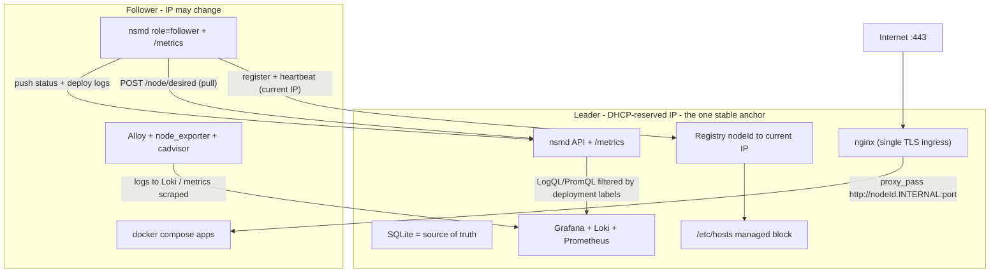
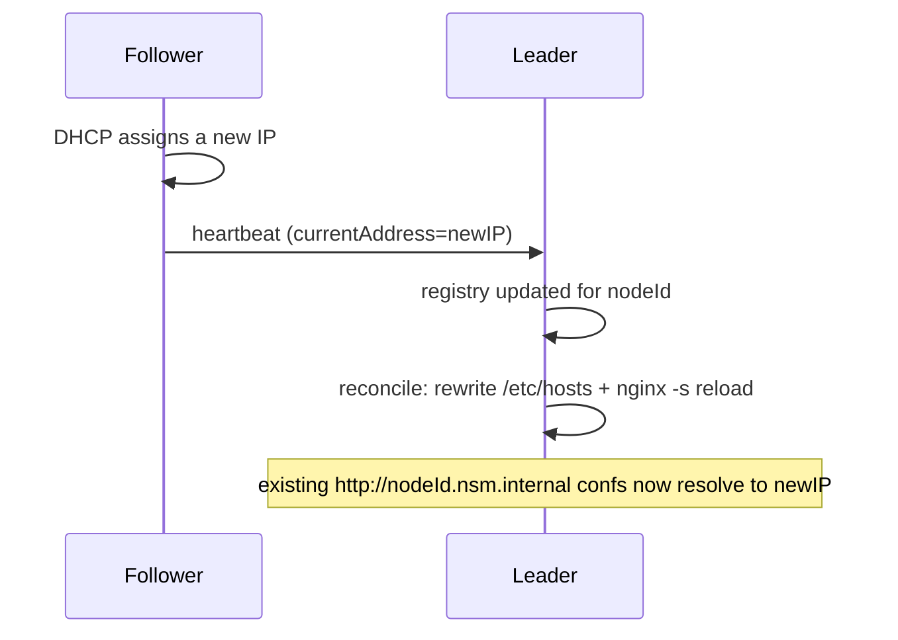

# NSM — Node Server Manager

NSM is a self-managing deployment system. You run a **single identical daemon (`nsmd`) on every machine** in a small fleet. Exactly one machine is statically declared the **leader**; its SQLite database is the single source of truth. The leader clones your app repos, injects secrets, runs them with `docker compose`, renders nginx, and issues TLS certs. Followers pull their assigned work from the leader and report status back.

Two design goals shape everything:

- **IP-less identity.** Nodes identify each other by a stable `nodeId`, never by IP. The leader keeps a `nodeId -> current IP` registry that every node updates via heartbeat, so a node's LAN IP can change (DHCP) without breaking routing.
- **Full observability.** A self-hosted Grafana + Loki + Prometheus stack collects logs and metrics from every node, tagged per deployment, so logs/stats for one deployment are directly queryable through the NSM API.

---

## Table of contents

- [Architecture](#architecture)
- [Coordination model (leader + registry)](#coordination-model-leader--registry)
- [IP-less routing](#ip-less-routing)
- [Ingress and TLS](#ingress-and-tls)
- [Observability](#observability)
- [Management UI](#management-ui)
- [How a deployment flows](#how-a-deployment-flows)
- [Failure handling](#failure-handling)
- [Repository layout](#repository-layout)
- [Configuration reference](#configuration-reference)
- [Setting up a network](#setting-up-a-network)
- [HTTP API surface](#http-api-surface)
- [Development and testing](#development-and-testing)

---

## Architecture



Every node runs the same `nsmd` process (on the host, via systemd, so it can drive `docker`/`nginx`/`certbot` directly). The only difference between nodes is `NSM_ROLE`.

All backend paths below are under `backend/`.

| Component | Path | Responsibility |
| --- | --- | --- |
| Cluster facade | `backend/src/cluster/node.ts` | `isLeader()`/`leaderAddress()` from config; `propose()` applies ops directly on the leader. |
| Registry | `backend/src/cluster/registry.ts` | Leader-hosted `nodeId -> current IP` map; register/heartbeat/deregister. |
| State machine | `backend/src/cluster/stateMachine.ts` | Applies each `Op` to the leader's SQLite source of truth. |
| Reconciler | `backend/src/reconcile/reconciler.ts` | Followers pull desired state; every node converges its host; leader renders ingress. |
| Internal DNS | `backend/src/reconcile/internalDns.ts` | Leader writes `/etc/hosts` mapping `<nodeId>.<domain>` to current IPs. |
| Certs | `backend/src/reconcile/certs.ts` | Leader-only certbot; certs live only on the leader (single ingress). |
| Observability | `backend/src/reconcile/observabilityStack.ts`, `promTargets.ts`, `backend/src/controllers/observabilityController.ts` | Bring up the stack, generate Prometheus targets, proxy per-deployment queries. |

---

## Coordination model (leader + registry)

- **One leader, declared in config.** Exactly one node sets `NSM_ROLE=leader`; all others are `follower`. There is no election and no automatic failover.
- **The leader's SQLite DB is the sole source of truth.** All writes are `Op`s applied directly on the leader (`cluster.propose(op)` -> `applyOp(op)`). Followers do not hold authoritative state.
- **Writes forward to the leader.** Any node accepts private API calls; write handlers call `requireLeader`, which proxies to the leader (`forwardToLeader`) using the stable `LEADER_ADDRESS`.
- **Followers pull, then push.** Each reconcile tick, a follower `POST /node/desired` to get its assigned `DesiredDeployment`s plus the registry snapshot, mirrors them into its local DB, and converges. It pushes status + deploy logs back to the leader.
- **The one stable anchor** is `LEADER_ADDRESS` — give the leader machine a DHCP reservation/static IP. Every other address is dynamic and resolved through the registry.

If the leader is down: running apps keep serving, but no new deploys/writes happen, and followers skip reconciliation (they never tear down running apps on a failed pull) until the leader returns.

---

## IP-less routing

Today a node's IP is never baked into a config. Instead:

1. Each node detects its current primary IP (`getPrimaryIp()`), registers it with the leader on boot, and re-asserts it on every heartbeat. An IP change for a stable `nodeId` propagates into the registry within one interval.
2. Rendered nginx configs target the assigned node's **stable internal hostname**: `proxy_pass http://<nodeId>.<INTERNAL_DOMAIN>:<port>` (e.g. `http://node-2.nsm.internal:34011`).
3. The leader maintains a managed block in `/etc/hosts` mapping every `<nodeId>.<INTERNAL_DOMAIN>` to its current IP (`refreshInternalHosts()`), and reloads nginx only when the mapping changes.

Because confs are IP-free, an IP change never re-renders a conf — it only refreshes the hosts mapping and reloads nginx.



---

## Ingress and TLS

- The **leader is the single public 443 entrypoint**. Point your router's 443 forward and your app DNS at the leader (DHCP-reserved). The leader terminates TLS and reverse-proxies to backend nodes by internal hostname.
- Only the leader renders nginx (`renderAllNginx`, guarded by `isLeader()`); followers just run app containers.
- Certs are **leader-local**: `leaderEnsureCerts()` runs certbot (DNS-01 when `CERTBOT_DNS_ARGS` is set, else `--nginx`) and keeps material in `LETSENCRYPT_LIVE_DIR`. No cross-node cert replication.

---

## Observability

A self-hosted stack (leader) plus per-node agents give logs + metrics filterable per deployment.

- **Leader stack** (`deploy/observability/docker-compose.yml`): Grafana, Loki, Prometheus. Brought up at boot by `ensureObservabilityStack()`.
- **Per-node agents** (`deploy/agent/docker-compose.yml`, on every node): Grafana Alloy (logs), node_exporter (host metrics), cadvisor (container metrics).
- **Deployment labels.** App containers are labeled with `dev.mosaiq.nsm.projectId`, `.projectInstanceId`, `.serviceInstanceId`, `.serviceName`, `.managed`. Alloy relabels these into Loki labels; cadvisor exposes them for Prometheus (`metric_relabel_configs` promote them to `projectInstanceId`, etc.).
- **nsmd logs.** `nsmd` logs structured JSON (pino); journald captures it; Alloy ships it to Loki labeled `source="nsmd"`, so control-plane and app logs are queryable together.
- **IP-less scraping.** `promTargets.ts` regenerates Prometheus file-SD targets from the registry using internal hostnames.
- **Query API.** The leader exposes `GET /observability/logs` and `GET /observability/metrics`, which proxy LogQL/PromQL filtered by `serviceInstanceId | projectInstanceId | projectId`, so the NSM UI can show logs/stats for one deployment. Every node also exposes `GET /metrics` (deploy/reconcile counters and durations).

---

## Management UI

NSM ships its own management UI in `frontend/` — a Vite + React + Mantine single-page app that replaces the old external `server-manager` frontend. There is no separate service to run: the leader daemon serves the built UI **same-origin** with the API.

- **Same-origin serving.** `initApp()` mounts `express.static(NSM_WWW_PATH)` and an SPA history fallback, so the UI, the API, and the OAuth callback all live on the leader's one origin. The client uses relative `fetch` calls — no `API_URL` baked into the build.
- **Build on the leader.** `bootstrap.sh` runs `build_frontend()` on the leader, which builds `frontend/` straight into `NSM_WWW_PATH`. In dev, `npm run build` defaults its `outDir` to `../.devdata/www` (matching the dev `NSM_WWW_PATH`).
- **Auth.** Sign-in uses the same GitHub OAuth flow as the API: the UI redirects to GitHub, GitHub calls the daemon's `/auth/github`, and the daemon redirects back to `FRONTEND_URL?token=…`. The token is stored in `localStorage` and sent as `Authorization: Bearer <token>`.
- **What it manages.** Dashboard, per-project config (repo, node assignment, nginx editor, env vars, services), deploy/teardown with live deployment logs, the read-only node registry, cluster status/health, per-deployment logs + metrics, and GitHub access management.

Client-side routes (`/`, `/p/:id/*`, `/nodes`, `/status`, `/access`) are chosen to never collide with API paths so deep links resolve through the SPA fallback.

Local development runs the Vite dev server and proxies the API to a locally running daemon:

```bash
# terminal 1: the daemon (uses .env.local; PRODUCTION=false stubs host side effects)
cd nsm && npm start

# terminal 2: the UI (proxies /projects, /cluster, /observability, ... to 127.0.0.1:1025)
cd nsm/frontend && npm ci && npm run dev   # http://localhost:5173
```

Build-time config is `VITE_`-prefixed (see `.env.sample`): `VITE_GITHUB_OAUTH_CLIENT_ID`, `VITE_GITHUB_OAUTH_CALLBACK_URL`, and optional `VITE_GITHUB_OAUTH_DEFAULT_USER`. The daemon reads these same three vars, so they are defined once; only `GITHUB_OAUTH_CLIENT_SECRET` is server-only.

---

## How a deployment flows

```mermaid
sequenceDiagram
    participant UI as UI/CI
    participant L as Leader
    participant N as Assigned node
    UI->>L: GET /deployweb/:projectId/:key
    L->>L: syncProjectToRepoData + compareProjects
    L->>N: POST /node/plan (allocate ports + dirs)
    N-->>L: { ports, dirs }
    L->>L: render dotenv + nginxConf(http://N.nsm.internal:port) + inject labels
    L->>L: applyOp(SET_DESIRED_DEPLOYMENT) into leader DB (generation+1)
    N->>L: POST /node/desired (pull) -> gets its DesiredDeployment
    N->>N: clone + docker compose up -d; POST /cluster/log progress
    L->>L: reconcile: renderAllNginx + refreshInternalHosts (reload nginx)
```

`generation` is a monotonic per-project counter; a node redeploys only when the desired generation differs from the generation marker it has on disk, so reconciliation is restart-safe.

---

## Failure handling

| Failure | Behavior |
| --- | --- |
| Leader down | Running apps keep serving; no new writes/deploys; followers skip pulls (never tear down) until it returns. |
| Follower IP changes | Registry updates via heartbeat; leader rewrites `/etc/hosts` + reloads nginx; confs unchanged. |
| Follower crash/restart | On boot it re-registers and replays generation markers; only redeploys on drift. |
| New follower joins | It registers with the leader and starts pulling its assigned deployments. |

Note: there is intentionally no ingress failover — the leader is the single entrypoint (the user's chosen tradeoff for simplicity).

---

## Repository layout

The repo is an npm-workspaces monorepo with three packages — `backend` (the daemon), `common` (shared, source-only), and `frontend` (the UI) — plus deploy/infra at the root.

```
nsm/                          # workspace root (npm workspaces: common, backend, frontend)
├── package.json              # workspace root + convenience scripts (start, web:dev, types, test)
├── .env.sample               # single env file for daemon + UI; copied to /etc/nsm/nsm.env on bootstrap
├── backend/                  # @mosaiq/nsm — the daemon (runs via tsx; served by systemd)
│   ├── src/
│   │   ├── index.ts          # boot: register -> (leader) observability -> reconcile + status
│   │   ├── config.ts         # env-driven config (role, leaderAddress, internalDomain, obs URLs)
│   │   ├── cluster/          # node facade, registry, stateMachine, leaderClient, statusGossip, selfUpdate
│   │   ├── reconcile/        # reconciler, deploy, teardown, nginxRender, certs, internalDns,
│   │   │                     #   promTargets, observabilityStack, ports, docker, directories, state
│   │   ├── controllers/      # project, deploy, secret, user, allowedEntity, status, observability
│   │   ├── persistence/      # Sequelize models (source of truth on the leader)
│   │   ├── host/exec.ts      # host command execution + getPrimaryIp()
│   │   ├── host/privilege.ts # sudo() wrapper (production only) + execWithInput()
│   │   └── utils/            # nginx, repo/git, auth, db, init, log (pino), metrics (prom-client)
│   ├── test/                 # Vitest suite
│   ├── tsconfig.json         # paths: @/* -> src/*, @mosaiq/nsm-common -> ../common/src
│   └── vitest.config.ts
├── common/                   # @mosaiq/nsm-common — shared types, routes, clusterOps (source-only)
│   ├── package.json
│   └── src/                  #   consumed by backend and frontend via TS/Vite path aliases
├── frontend/                 # @mosaiq/nsm-frontend — Vite + React + Mantine UI (built into NSM_WWW_PATH)
├── deploy/
│   ├── observability/        # leader stack compose + prometheus + grafana provisioning
│   ├── agent/                # per-node alloy + node_exporter + cadvisor
│   ├── nginx.main.conf       # include directive for host nginx
│   ├── nsm-apply-hosts       # root helper: atomically rewrites /etc/hosts from stdin (via sudo)
│   └── nsm.sudoers           # scoped NOPASSWD policy installed to /etc/sudoers.d/nsm
├── systemd/nsmd.service      # host systemd unit (runs as the nsm user)
├── install.sh                # universal one-command installer (leader git-clone / follower bundle)
└── bootstrap.sh              # --leader / --follower installer (run as root; creates the nsm user)
```

---

## Configuration reference

Config is read from process env, then the repo-root `.env.local`, then `.env`, then `/etc/nsm/nsm.env`. A single root env file is shared by the daemon and the Vite UI build (only `VITE_`-prefixed vars reach the client bundle). See `.env.sample`; all values live in `backend/src/config.ts`.

Identity/role:
- `PRODUCTION` — `true` on real hosts (dev stubs host side effects).
- `NODE_ID` — stable unique id.
- `NSM_ROLE` — `leader` (exactly one) or `follower`.
- `BIND_ADDRESS` — fallback IP only; the current IP is auto-detected at runtime.
- `API_PORT` — HTTP API + inter-node RPC + `/metrics`.

Cluster:
- `LEADER_ADDRESS` — the one stable anchor (leader's base URL; DHCP-reserved).
- `INTERNAL_DOMAIN` — default `nsm.internal`; nodes addressed as `<nodeId>.<INTERNAL_DOMAIN>`.
- `CLUSTER_SECRET` — authenticates internal RPCs (register/pull/status/self-update).

Data paths: `DATABASE_DIR`, `DATABASE_NAME`, `REPO_SANDBOX_PATH`, `DEPLOYMENT_PATH`, `PERSISTENT_PATH`, `NGINX_CONF_DIR`, `LETSENCRYPT_LIVE_DIR`, `NSM_WWW_PATH`.

Git/GitHub: `GIT_SSH_KEY_DIR`, `GIT_SSH_KEY_FILE`, `VITE_GITHUB_OAUTH_CLIENT_ID`, `VITE_GITHUB_OAUTH_CALLBACK_URL`, `VITE_GITHUB_OAUTH_DEFAULT_USER`, `GITHUB_OAUTH_CLIENT_SECRET`, `CERTBOT_DNS_ARGS`, `NSM_REPO_DIR`.

Observability: `LOKI_URL`, `PROMETHEUS_URL`, `GRAFANA_URL` (leader query proxy), `OBS_LOKI_PUSH_URL` (agents; defaults to the leader host on `:3100`).

---

## Setting up a network

Prerequisites: Ubuntu hosts on the same LAN; the leader machine on a DHCP reservation/static IP; root/sudo; DNS for each app domain pointing at the leader. The installer/bootstrap installs node 22, nginx, certbot, docker, jq, etc.; agents/stack run as containers.

### One command per node

`install.sh` fetches the code and delegates to `bootstrap.sh`. Both roles are a single paste.

1. **Leader** (first node) — pull the installer straight from GitHub:
   ```bash
   curl -fsSL https://raw.githubusercontent.com/mosaiq-software/nsm/main/install.sh | sudo bash -s -- --leader
   ```
   This clones the repo, bootstraps the leader, generates the shared git **deploy key**, and prints its public half. Register that public key **once** on GitHub (a repo/org deploy key or a machine user) so every node can clone your app repos. Then set your real values in `/etc/nsm/nsm.env` (`CLUSTER_SECRET`, `PRODUCTION=true`, GitHub OAuth) and `sudo systemctl restart nsmd`. Verify: `curl -s localhost:1025/healthz | jq`.

2. **Followers** (joining nodes) — copy the ready-made command from the dashboard's **Nodes → Add a node** panel, or build it by hand:
   ```bash
   curl -fsSL http://<leader-ip>:1025/install.sh | sudo bash -s -- --secret <CLUSTER_SECRET>
   ```
   The leader-served `install.sh` bakes in its own URL. The follower downloads the code bundle and the shared deploy key from the leader (both gated by the cluster secret), bootstraps itself, registers into the leader's registry, and starts pulling assigned work. No manual key handling.

3. Point app-domain DNS at the leader. The leader terminates TLS and proxies to whichever node runs each app.

4. Create/assign/deploy a project via the API (below) or dashboard.

The lower-level `bootstrap.sh --leader` / `bootstrap.sh --follower --leader <url> --secret <token>` entry points still work if you've already cloned the repo.

### Shared deploy key

Every node clones app repos over SSH using one **shared** deploy key. The leader generates it on first bootstrap (`/etc/nsm/.ssh/id_ed25519` by default) and serves the private half to joining followers over the secret-gated `GET /cluster/deploy-key`. You register the public half on GitHub exactly once.

### The `nsm` user and privileges

`nsmd` does **not** run as root. Bootstrap creates a dedicated system user `nsm`, adds it to the `docker` group, and `chown`s the daemon's data directories (`/opt/nsm`, `/var/lib/nsm`, `/nsm`, `/etc/nsm`, `NSM_WWW_PATH`) to it. The few genuinely root-only commands are granted through a scoped `/etc/sudoers.d/nsm` policy (NOPASSWD for exactly `nginx -t`, `nginx -s reload`, `certbot *`, `openssl x509 *`, `systemctl restart nsmd`, and the `/usr/local/sbin/nsm-apply-hosts` helper that rewrites `/etc/hosts`). Docker operations go through group membership, not sudo. In dev/test (`PRODUCTION != true`) none of these are sudo-prefixed.

---

## HTTP API surface

Three routers (`backend/src/routes.ts`):

- Public: `GET /healthz`, `GET /metrics`, `GET /install.sh` (leader-templated universal installer), `GET /auth/github`, `POST /login/github/:token`, CI deploy webhook `GET /deploy/:projectId/:key`. The leader also serves the built UI (`express.static(NSM_WWW_PATH)`) with an SPA history fallback for non-API GETs.
- Private (user token): project/secret/user/allow-list CRUD, `GET /cluster/status`, `GET /cluster/nodes`, `GET /cluster/join-info` (copy-paste join command + deploy public key), dashboard deploy `GET /deployweb/:projectId/:key`, and observability `GET /observability/logs`, `GET /observability/metrics`. Writes on a follower forward to the leader.
- Internal (`x-nsm-cluster-secret`): `/cluster/register`, `/cluster/deregister`, `GET /install/bundle.tgz` (leader source bundle), `GET /cluster/deploy-key` (shared deploy key), `/node/desired`, `/cluster/log`, `/cluster/status-report`, `/node/plan`, `/cluster/self-update`, `/cluster/apply-update`.

---

## Development and testing

Requires Node 22+. This is an npm-workspaces monorepo; a single install at the root covers all three packages.

```bash
cd nsm
npm ci             # installs common + backend + frontend (hoisted)

# Backend daemon (@mosaiq/nsm). Reads backend/.env.local; PRODUCTION=false stubs host side effects.
npm start          # -> npm start -w backend  (dev daemon on :1025)
npm run types      # -> backend + frontend tsc --noEmit
npm test           # -> npm test -w backend  (Vitest suite)

# Management UI (@mosaiq/nsm-frontend) against the local daemon via the Vite dev proxy.
npm run web:dev    # -> npm run dev -w frontend  (http://localhost:5173, proxies API to :1025)
npm run web:build  # -> npm run build -w frontend (builds into ../.devdata/www or NSM_UI_OUT)
```

You can also target a single workspace directly, e.g. `npm run test:cov -w backend` or `cd frontend && npm run dev`.
