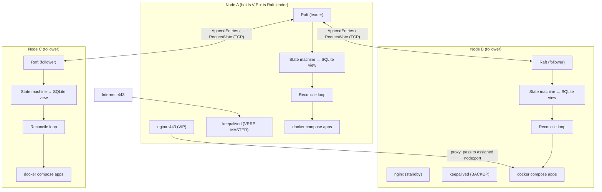
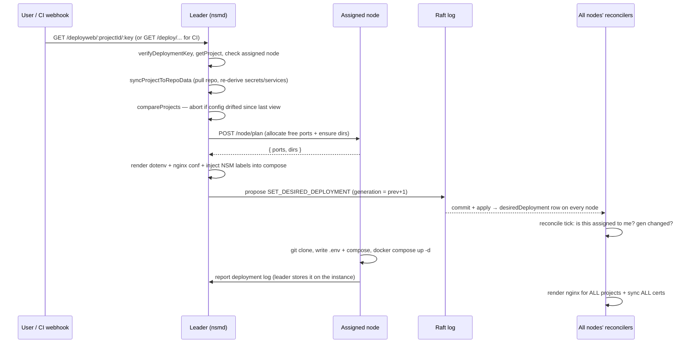
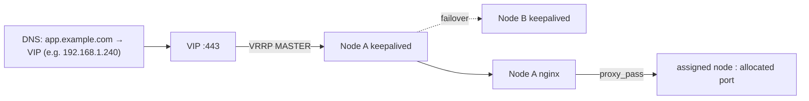
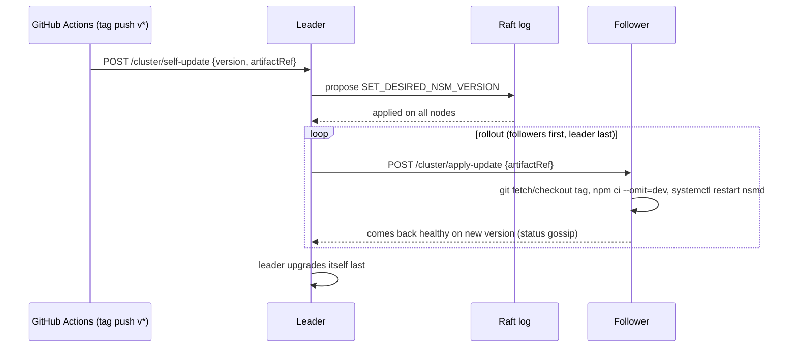

# NSM — Node Server Manager

NSM is a self-managing, distributed deployment system. You run a **single identical daemon (`nsmd`) on every machine** in a small fleet; the daemons form a [Raft](https://raft.github.io/) cluster, elect a leader, and keep a **replicated log** of everything that should be running. Any node can serve production traffic on port 443, and the cluster survives the loss of any minority of nodes with no manual failover.

It clones your app repos, injects secrets, runs them with `docker compose`, renders nginx configs, provisions TLS certificates, and keeps the whole fleet converged toward a single declared desired state — including keeping **itself** up to date.

---

## Table of contents

- [Why it was redesigned](#why-it-was-redesigned)
- [Core ideas](#core-ideas)
- [Architecture](#architecture)
- [How a deployment flows through the system](#how-a-deployment-flows-through-the-system)
- [The replicated state machine](#the-replicated-state-machine)
- [Networking: the floating VIP](#networking-the-floating-vip)
- [TLS certificates](#tls-certificates)
- [Self-updating](#self-updating)
- [Failure handling](#failure-handling)
- [Repository layout](#repository-layout)
- [Configuration reference](#configuration-reference)
- [Setting up a network](#setting-up-a-network)
- [Day-2 operations](#day-2-operations)
- [HTTP API surface](#http-api-surface)
- [Development & testing](#development--testing)
- [Troubleshooting](#troubleshooting)

---

## Why it was redesigned

The previous system had a **control plane** on one machine plus **worker nodes** on the others. Port 443 was forwarded to the single control-plane machine, which ran nginx and orchestrated everything. To do real work, `server-manager` sent commands to `server-manager-worker`, which shelled out to `pm2` outside its container. This was fragile: a single point of failure for ingress, a brittle multi-process command chain, and awkward host access from inside a container.

NSM replaces all of that with **one process per machine, all equal**:

| Old model | New model (NSM) |
| --- | --- |
| 1 control plane + N workers | N identical `nsmd` daemons |
| 443 pinned to one machine | Floating **VIP** (VRRP) any node can hold |
| Cross-process RPC → pm2 | Daemon runs on the host via systemd, drives docker/nginx/certbot directly |
| Control-plane DB is the source of truth | **Raft replicated log** is the source of truth |
| Manual failover | Automatic leader election + VIP failover |

---

## Core ideas

- **One daemon per host.** `nsmd` runs on the host (not in a container) under systemd so it can directly call `docker`, `nginx`, and `certbot`. There is no separate worker process and no named pipe.
- **Raft is the source of truth.** All writes (projects, secrets, users, node membership, desired deployments, certs, desired NSM version) are proposed as **operations** appended to a replicated log. Each node applies committed operations, in order, to a **local SQLite materialized view**. Reads are served from that local view.
- **Declarative reconciliation.** The leader turns a deploy request into a fully self-contained `DesiredDeployment` (rendered dotenv, compose, nginx conf, domains, assigned node) and replicates it. Every node runs a **reconcile loop** that converges its host toward whatever is assigned to it.
- **Ingress is decoupled from consensus.** A floating **Virtual IP** managed by keepalived/VRRP owns port 443. Whichever node holds the VIP terminates TLS and proxies to backends. VRRP election is independent of Raft leadership — losing the leader does not necessarily move the VIP, and vice versa.
- **Self-contained + self-updating.** A single `bootstrap.sh` installs and joins a node. A git tag push tells the cluster to roll itself to a new version, followers first.

---

## Architecture



Each node runs the same components:

| Component | Path | Responsibility |
| --- | --- | --- |
| **Raft** | `src/cluster/raft.ts`, `raftLog.ts`, `transport.ts` | Leader election, log replication, membership changes over newline-delimited JSON on TCP. |
| **State machine** | `src/cluster/stateMachine.ts` | Applies each committed `Op` to the local SQLite view; tracks `lastAppliedIndex` for idempotent replay. |
| **Cluster facade** | `src/cluster/node.ts` | Wires Raft + state machine; exposes `propose`, `addNode`, `removeNode`, `status`, `isLeader`, `leaderAddress`. |
| **Reconciler** | `src/reconcile/*` | Converges the host: clone/deploy/teardown apps, render nginx, sync certs, manage keepalived. |
| **Controllers** | `src/controllers/*` | Business logic for projects/secrets/users/deploys. Writes become Raft proposals; reads hit the local view. |
| **HTTP API** | `src/routes.ts`, `src/app.ts` | Public (health, OAuth, deploy webhook), private (user-authenticated CRUD), internal (cluster-secret RPCs). |
| **Persistence** | `src/persistence/*` | Sequelize models over SQLite — the materialized view + Raft metadata. |

---

## How a deployment flows through the system

A deploy is a **leader-only** operation. Followers transparently forward writes to the leader (`requireLeader` → `forwardToLeader`).



Key properties:

- The `DesiredDeployment` is **fully rendered and self-contained** — the compose file, `.env`, nginx conf and domains all travel inside the replicated log. Any node can act on it without re-reading the repo.
- **`generation`** is a monotonic counter per project. A node's reconciler compares the desired generation to the generation it has locally deployed (a marker file under `DATABASE_DIR/generations`) and only redeploys on drift, so it is restart-safe.
- **nginx is rendered on every node**, not just the assigned one, because any node may hold the VIP. The VIP-holder's nginx proxies `https://domain` → `http://<assigned-node-ip>:<allocated-port>`.

---

## The replicated state machine

Every mutation is an `Op` appended to the Raft log (`common/src/clusterOps.ts`). Committed ops are applied deterministically and idempotently by `applyOp` (`src/cluster/stateMachine.ts`):

| Op | Effect on the local view |
| --- | --- |
| `UPSERT_PROJECT` / `DELETE_PROJECT` | Create/replace or remove a project (delete also clears its desired deployment). |
| `SET_PROJECT_SECRETS` | Replace a project's full secret set. |
| `UPSERT_SECRET` | Update/insert a single secret. |
| `SET_PROJECT_ASSIGNMENT` | Assign a project to a node (`workerNodeId`). |
| `SET_DESIRED_DEPLOYMENT` / `CLEAR_DESIRED_DEPLOYMENT` | Declare or remove what a node must run. |
| `UPSERT_CERT` | Replicate TLS material (fullchain + privkey + expiry) to all nodes. |
| `UPSERT_NODE` / `REMOVE_NODE` | Cluster membership bookkeeping in the view. |
| `SET_DESIRED_NSM_VERSION` | Record the version the fleet should roll to. |
| `UPSERT_USER` | Sign-in / sign-out state for dashboard users. |
| `SET_ALLOWED_ENTITIES` | Replace the GitHub user/org allow-list. |

**Why a log + view instead of just a shared DB?** The log gives a total order and a durable, replayable history. A node that has been offline, or a brand-new node, catches up simply by replaying the log from the start (NSM keeps the full log rather than implementing snapshot-install). `lastAppliedIndex` is persisted so a restarting node never re-applies work it already applied.

Membership changes (`addLearner` / `removeNode`) are themselves special `config` entries in the log; when applied, each node rewrites its local `cluster.json` so the peer set survives restarts.

---

## Networking: the floating VIP

Port 443 is owned by a **Virtual IP** that floats between nodes via **VRRP** (keepalived). Your router/DNS points the public name at the VIP, not at any single machine.



- `src/reconcile/keepalived.ts` renders `/etc/keepalived/keepalived.conf` from `deploy/keepalived.conf.tmpl`. Each node gets a deterministic priority derived from its `nodeId`, plus a health check that curls the local `/healthz`. If `nsmd`/nginx becomes unhealthy on the VIP holder, VRRP moves the VIP to another node within seconds.
- Because every node renders nginx for **all** projects and holds **all** replicated certs, the new VIP holder can serve traffic immediately — no config regeneration needed at failover time.
- **VRRP election is intentionally separate from Raft leadership.** The data plane (who answers 443) and the control plane (who accepts writes) fail over independently.

> Same-LAN requirement: VRRP uses L2 multicast, so all nodes must share a subnet. The VIP is a spare address on that subnet.

---

## TLS certificates

- **Leader** (`leaderEnsureCerts` in `src/reconcile/certs.ts`): for every domain in the desired deployments, if there is no cert or it expires within 30 days, it runs `certbot` (DNS-01 when `CERTBOT_DNS_ARGS` is set — recommended, since it works regardless of which node holds the VIP — otherwise `--nginx` HTTP-01), then proposes `UPSERT_CERT` to replicate the material into the log.
- **Every node** (`syncCertsToDisk`): writes the replicated cert material to `LETSENCRYPT_LIVE_DIR/<domain>/` (write-if-changed) so its local nginx can terminate TLS the instant it holds the VIP.

Renewal runs on a cron registered at boot (`src/utils/initUtils.ts`).

---

## Self-updating

NSM upgrades itself via a git-tag-driven rolling upgrade.



- `.github/workflows/nsm-release.yml` fires on `v*` tags and calls `/cluster/self-update`.
- `runSelfUpdateRolloutIfLeader` (`src/cluster/selfUpdate.ts`) runs on a cron; it upgrades one stale follower at a time and the leader last, using status gossip to know which nodes are still on the old version. systemd `Restart=always` brings each `nsmd` back on the new code.

---

## Failure handling

| Failure | What happens |
| --- | --- |
| **Leader crashes** | Remaining nodes elect a new leader (majority quorum). In-flight uncommitted writes are retried by the client against the new leader. |
| **VIP holder crashes** | keepalived moves the VIP to another node; its already-rendered nginx + synced certs serve traffic immediately. |
| **Follower crashes/restarts** | On restart it replays the log from disk (persisted term/vote/log), catches up missed entries via `AppendEntries` backtracking, and does not re-apply already-applied ops. |
| **New node joins** | Leader appends a membership config entry and streams the full log to the newcomer until it is caught up. |
| **Network partition** | Only the side with a majority can elect a leader and commit; the minority side serves reads from its (possibly stale) view but rejects writes. |

Quorum math is standard Raft: a cluster of `N` tolerates `floor((N-1)/2)` failures. Run an **odd** number of nodes (3 or 5).

---

## Repository layout

```
nsm/
├── src/
│   ├── index.ts              # boot sequence
│   ├── config.ts             # env-driven config + cluster.json load/save
│   ├── app.ts, routes.ts     # express app + public/private/internal routers
│   ├── cluster/              # raft, transport, log, state machine, node facade,
│   │                         #   membership, leaderClient, statusGossip, selfUpdate
│   ├── reconcile/            # reconciler, deploy, teardown, ports, docker,
│   │                         #   nginxRender, certs, keepalived, directories, state
│   ├── controllers/          # project, deploy, secret, user, allowedEntity, status
│   ├── persistence/          # Sequelize models (the materialized view + raft meta)
│   ├── host/exec.ts          # direct host command execution (child_process)
│   └── utils/                # nginx rendering, repo/git, auth, db, init
├── common/src/               # shared types, routes, clusterOps, secret/git utils
├── deploy/                   # nginx include + keepalived.conf template
├── systemd/nsmd.service      # the systemd unit
├── bootstrap.sh              # one-command node install/join
├── .github/workflows/        # self-update release workflow
├── .env.sample               # every configurable value
└── test/                     # Vitest suite (unit + real-TCP raft + supertest)
```

---

## Configuration reference

Config is read from environment variables, layered as: process env → `./.env` → `/etc/nsm/nsm.env` (later files do **not** override values already set). See `.env.sample` for a complete template. All values live in `src/config.ts`.

### Identity & networking (per node)
| Var | Default | Meaning |
| --- | --- | --- |
| `PRODUCTION` | `false` | `true` on real hosts. In dev, host side effects (docker/nginx/certbot/keepalived) are stubbed out. |
| `NODE_ID` | `node-local` | Stable unique id for this node. |
| `BIND_ADDRESS` | `127.0.0.1` | This node's LAN IP (advertised to peers). |
| `API_PORT` | `1025` | HTTP API + inter-node RPC port. |
| `RAFT_PORT` | `1027` | Raft TCP transport port. |

### Cluster & VIP
| Var | Default | Meaning |
| --- | --- | --- |
| `CLUSTER_SECRET` | `insecure-dev-secret` | Shared secret: authenticates internal RPCs and join tokens. **Set this.** |
| `NSM_BOOTSTRAP` | _(empty)_ | `init` on the very first node of a new cluster; empty otherwise. |
| `VIP` | _(empty)_ | Floating virtual IP for 443. Empty disables keepalived. |
| `VRRP_ROUTER_ID` | `51` | VRRP virtual router id (same across the cluster). |
| `VRRP_PASS` | `changeme` | VRRP auth password (same across the cluster). |
| `VRRP_IFACE` | `eth0` | Network interface the VIP binds to. |

### Data paths
| Var | Default | Meaning |
| --- | --- | --- |
| `DATABASE_DIR` | `/var/lib/nsm` | SQLite view + generation markers. |
| `DATABASE_NAME` | `nsmdb.sqlite` | SQLite filename. |
| `RAFT_DATA_DIR` | `/var/lib/nsm/raft` | Raft log + hard state on disk. |
| `REPO_SANDBOX_PATH` | `/var/lib/nsm/sandbox` | Scratch space for repo introspection. |
| `DEPLOYMENT_PATH` | `/nsm/apps` | Where app repos are cloned and run. |
| `PERSISTENT_PATH` | `/var/lib/nsm/persistent` | Base for app persistent volumes/dirs. |
| `NGINX_CONF_DIR` | `/etc/nsm/nginx` | Rendered per-project nginx confs (included by host nginx). |
| `LETSENCRYPT_LIVE_DIR` | `/etc/letsencrypt/live` | Where synced certs are written. |
| `NSM_WWW_PATH` | `/var/lib/nsm/www` | Static dashboard files served by the daemon. |

### Git / GitHub / self-update
| Var | Default | Meaning |
| --- | --- | --- |
| `GIT_SSH_KEY_DIR` / `GIT_SSH_KEY_FILE` | `/etc/nsm/.ssh` / `id_ed25519` | Deploy key for cloning private repos over SSH. |
| `GITHUB_OAUTH_CLIENT_ID` / `_SECRET` / `_CALLBACK_URL` | — | Dashboard login via GitHub OAuth. |
| `GITHUB_OAUTH_DEFAULT_USER` | — | A GitHub login always allowed to sign in (bootstrap admin). |
| `CERTBOT_DNS_ARGS` | _(empty)_ | certbot DNS-01 plugin args, e.g. `--dns-cloudflare --dns-cloudflare-credentials /etc/nsm/cf.ini`. |
| `NSM_REPO_DIR` | `/opt/nsm` | Where the daemon's own code lives (for self-update). |
| `FRONTEND_URL` | — | Dashboard origin (OAuth redirects). |

> Optional test/dev knobs: `RAFT_ELECTION_MIN_MS`, `RAFT_ELECTION_MAX_MS`, `RAFT_HEARTBEAT_MS` override Raft timers (production defaults are 1200–2400ms election, 350ms heartbeat).

---

## Setting up a network

### Prerequisites

- 3 (or 5) Linux hosts (Debian/Ubuntu assumed by `bootstrap.sh`) on the **same LAN/subnet**.
- One **spare IP** on that subnet to use as the VIP.
- Root/sudo on each host. `bootstrap.sh` installs: `node 22`, `nginx`, `keepalived`, `certbot`, `docker`, `netcat`, `jq`, `git`.
- A **DNS record** for each app domain pointing at the VIP.
- (For private repos) a GitHub **deploy key**; (for the dashboard) a GitHub **OAuth app**.

### 1. Bootstrap the first node (creates the cluster)

```bash
git clone <this-repo> nsm && cd nsm
sudo ./bootstrap.sh --init
```

On first run this copies the code to `/opt/nsm`, creates `/etc/nsm/nsm.env` from `.env.sample` (auto-filling `NODE_ID`, `BIND_ADDRESS`, `VRRP_IFACE`), installs the systemd unit, wires the nginx include, and writes a single-node `cluster.json`. **Edit `/etc/nsm/nsm.env`** — at minimum set `CLUSTER_SECRET`, `VIP`, `PRODUCTION=true`, and the GitHub values — then re-run `sudo ./bootstrap.sh --init` (idempotent) or `sudo systemctl restart nsmd`.

Verify:

```bash
journalctl -u nsmd -f
curl -s localhost:1025/healthz | jq   # { ok, nodeId, isLeader, leader, version }
```

### 2. Add the git deploy key & GitHub fingerprints

Place the private deploy key at `${GIT_SSH_KEY_DIR}/${GIT_SSH_KEY_FILE}` (default `/etc/nsm/.ssh/id_ed25519`, mode `600`) and add its public half as a repo/org deploy key on GitHub. NSM installs GitHub's SSH host fingerprints automatically at boot.

### 3. Join additional nodes

On each new host, clone the repo and join using the first node's (or the VIP's) API and the shared secret:

```bash
sudo ./bootstrap.sh --join http://<leader-or-vip>:1025 --secret <CLUSTER_SECRET>
```

This POSTs to `/cluster/join`; the leader appends a membership entry, streams the full log to the newcomer, and returns the authoritative `cluster.json`. Watch it catch up with `journalctl -u nsmd -f`.

### 4. Point DNS at the VIP

Create `A` records for your app domains → the `VIP`. The VIP-holding node terminates TLS and proxies to whichever node runs each app.

### 5. Create and deploy a project

Use the dashboard (served at `NSM_WWW_PATH`) or the API to create a project, assign it to a node, and deploy. See [Day-2 operations](#day-2-operations).

---

## Day-2 operations

All commands hit the API on any node (writes auto-forward to the leader). Private routes need a user `Authorization` token; the deploy webhook uses the per-project key.

- **Create a project:** `POST /project/create` with `{ id, repoOwner, repoName }`. NSM generates a deployment key and syncs repo metadata (compose services + env vars).
- **Assign to a node:** `POST /project/:projectId/assign` with `{ nodeId }`.
- **Set secret values:** `POST /project/:projectId/updateEnvVar`.
- **Deploy (from the dashboard):** `GET /deployweb/:projectId/:key`.
- **Deploy (from CI):** `GET /deploy/:projectId/:key` — requires the project's `allowCICD` flag.
- **Tear down:** `POST /project/:projectId/teardown` (clears the desired deployment; owning node's reconciler `docker compose down` + prunes).
- **Cluster status:** `GET /cluster/status` → leader, term, nodes, per-node health (version, reachable, VIP holder), desired NSM version.
- **List nodes:** `GET /cluster/nodes`.
- **Remove a node:** `POST /cluster/remove` `{ nodeId }` (internal, cluster-secret authed).
- **Roll a new NSM version:** push a `v*` git tag — CI notifies `/cluster/self-update` and the fleet rolls itself.

Dynamic env variables let a secret resolve at deploy time to allocated values — the proxy `Port`, static `Directory`, server `Domain`/`URL`, redirect `Target`, volume path, and assigned `WorkerNodeId` (see `common/src/secretUtil.ts`).

---

## HTTP API surface

Three routers (`src/routes.ts`):

- **Public** (no auth): `GET /`, `GET /healthz`, `GET /auth/github`, `POST /login/github/:token`, and the CI deploy webhook `GET /deploy/:projectId/:key`.
- **Private** (user `Authorization` token via GitHub OAuth): project/secret/user/allow-list CRUD, `GET /cluster/status`, `GET /cluster/nodes`, dashboard deploy `GET /deployweb/:projectId/:key`. Writes on a follower are transparently forwarded to the leader.
- **Internal** (each route guarded by the `x-nsm-cluster-secret` header): `/cluster/join`, `/cluster/remove`, `/cluster/log`, `/cluster/status-report`, `/node/plan`, `/cluster/self-update`, `/cluster/apply-update`, and (non-production only) `/cluster/dev-propose`, `/cluster/dev-dump`.

Route definitions and their typed params/bodies/returns live in `common/src/routes.ts`.

---

## Development & testing

Requires Node 22+.

```bash
cd nsm
npm ci
npm start          # run the daemon (dev: host side effects are stubbed when PRODUCTION!=true)
npm run dev        # watch mode
npm run types      # tsc --noEmit
npm run lint

npm test           # full Vitest suite
npm run test:watch
npm run test:cov   # coverage report (HTML in coverage/)
```

The test suite (`test/`) covers pure utilities, the SQLite persistence layer + state machine, the Raft log/transport, **real multi-node Raft over TCP** (election, replication, membership, failover, log repair, restart durability), the reconcile modules (with `host/exec` and fs mocked), the controllers, cluster wiring, and the HTTP layer via supertest. Raft timers are overridable via env so integration tests run fast and deterministically.

---

## Troubleshooting

- **`curl /healthz` shows `isLeader:false` everywhere / no leader:** peers can't reach each other on `RAFT_PORT`. Check firewalls and that each node's `BIND_ADDRESS` is its real LAN IP.
- **A joined node never catches up:** confirm the `CLUSTER_SECRET` matches and the join URL is reachable; watch `journalctl -u nsmd -f` on both nodes.
- **443 not reachable / VIP not assigned:** ensure all nodes share a subnet, `VIP` is a free address on it, `VRRP_IFACE` is correct, and keepalived is running (`systemctl status keepalived`). Only production nodes with a `VIP` set participate.
- **TLS errors after failover:** verify the domain's cert exists in `LETSENCRYPT_LIVE_DIR` on the current VIP holder; the leader must have successfully run certbot and proposed `UPSERT_CERT`.
- **Deploy aborts with "configuration changed after syncing":** the project's config in the view no longer matches the repo — re-sync/review the project, then redeploy.
- **Writes return 503 "No leader elected yet":** the cluster has no quorum (too many nodes down). Restore a majority.
```

